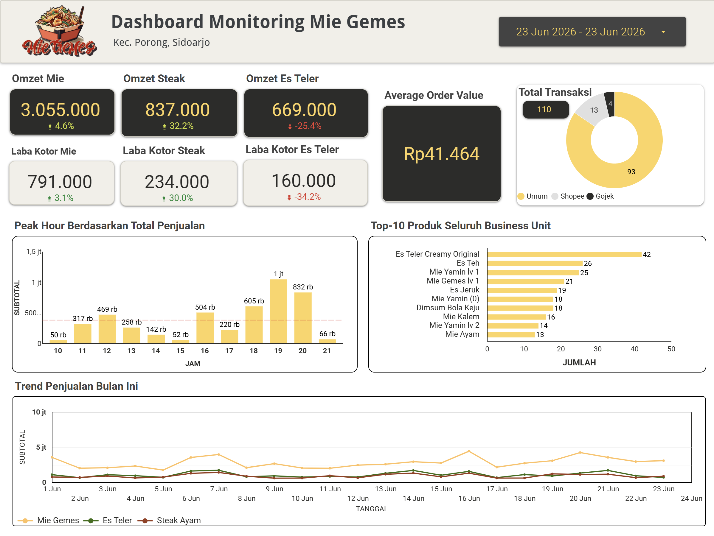

# 🍜 Mie Gemes — Business Monitoring Dashboard

Real-world sales monitoring dashboard built for my own F&B business, **Mie Gemes** (Kec. Porong, Sidoarjo), to track daily revenue, peak hours, top products, and order channel mix across 3 business units (Mie, Steak, Es Teler).

> 📌 This dashboard uses **real operational data** from my own business — not a sample/dummy dataset.

## 🎯 Problem
As a small F&B business with 3 product lines and multiple sales channels (walk-in, Shopee, Gojek), I needed a way to monitor daily performance at a glance — which products are driving revenue, when demand peaks, and how each business unit is trending — instead of manually checking raw transaction records.

## 🛠️ Tools & Techniques
- **Looker Studio/Data Studio** — dashboard build & data visualization
- Connected to live transaction data source
- Key components:
  - KPI cards (Omzet & Laba Kotor per business unit, Average Order Value)
  - Donut chart for order channel breakdown (Umum / Shopee / Gojek)
  - Bar chart for peak hour analysis
  - Horizontal bar chart for Top-10 products across all business units
  - Multi-line trend chart for daily sales comparison across product lines
  - Date range filter for flexible period analysis

## 📊 Snapshot — 23 June 2026

| Metric | Value | Change |
|---|---|---|
| Omzet Mie | Rp3.055.000 | ▲ 4.6% |
| Omzet Steak | Rp837.000 | ▲ 32.2% |
| Omzet Es Teler | Rp669.000 | ▼ -25.4% |
| Average Order Value | Rp41.464 | — |
| Total Transaksi | 110 | — |

## 🔍 Key Insights

1. **Steak is the fastest-growing line, but still small in absolute scale.** Steak revenue jumped +32.2% in a single day, while Es Teler dropped -25.4% — a sharp divergence worth investigating (promo effect? stock issue? day-of-week pattern?).

2. **Peak hour has two demand windows, not one.** Beyond the expected evening peak (7 PM, Rp1,000,000), there's a secondary midday spike at 12 PM (Rp469,000) — useful for adjusting staff shifts beyond just dinner rush.

3. **Drinks dominate transaction volume, not revenue.** Es Teler Creamy Original (42 orders) and Es Teh (26 orders) top the product list by quantity — ahead of any noodle variant — but contribute far less to revenue per item, reinforcing the case for food+drink bundling to lift AOV.

4. **Online channel penetration remains low.** Out of 110 transactions, only 17 (~15.5%) came from Shopee + Gojek combined — indicating most sales still depend on walk-in customers, with room to grow delivery channel adoption.

## 📁 Files
- `images/` — dashboard screenshots
- (Live dashboard not publicly linked due to ongoing operational data updates — screenshots reflect a point-in-time snapshot)
